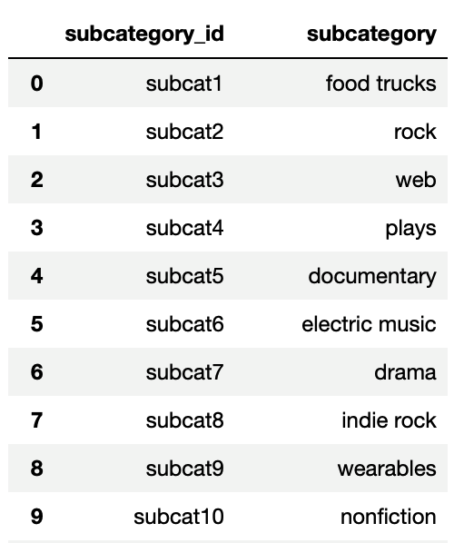

# Crowdfunding_ETL
The purpose of this project is to build an ETL pipeline using Python, Pandas, and regular expressions to extract, transform, and load data into a Postgres database with CSV files, and create an ERD and table schema.

### Navigation
All branches have been merged with main for ease of navigation.
'ETL_Mini_Project_CLi_JHashi_HDikian_EScribner' - the code used to generate the CSVs.
'crowdfunding_db_schema' contains the layout of the database. 
'crowdfunding_db' contains the code used to generate the tables in the database.
'crowdfunding_db_screenshots' contains screenshots of the select statements properly retrieving information from the tables.

## Instructions
The instructions for this mini-project are divided into the following subsections:
- Create the Category and Subcategory DataFrames
  
- Create the Campaign DataFrame
  
- Create the Contacts DataFrame
  
- Create the Crowdfunding Database

### Create the Category and Subcategory DataFrames
1: Extract and transform the **crowdfunding.xlsx** Excel data to create a category DataFrame that has the following columns:
 - A "category_id" column that has entries going sequentially from "cat1" to "catn", where n is the number of unique categories.
 - A "category" column that contains only the category titles.
 - The following image shows this category DataFrame:

2: Export the category DataFrame as **category.csv** and save it to the GitHub repository.

3: Extract and transform the **crowdfunding.xlsx** Excel data to create a subcategory DataFrame that has the following columns:
  - A "subcategory_id" column that has entries going sequentially from "subcat1" to "subcatn", where n is the number of unique subcategories.
  - A "subcategory" column that contains only the subcategory titles
  - The following image shows this subcategory DataFrame:

4: Export the subcategory DataFrame as **subcategory.csv** and save it to the GitHub repository.

### Create the Campaign DataFrame
1: Extract and transform the **crowdfunding.xlsx** Excel data to create a campaign DataFrame has the following columns:

- The "cf_id" column
- The "contact_id" column
- The "company_name" column
- The "blurb" column, renamed to "description"
- The "goal" column, converted to the float data type
- The "pledged" column, converted to the float data type
- The "outcome" column
- The "backers_count" column
- The "country" column
- The "currency" column
- The "launched_at" column, renamed to "launch_date" and with the UTC times converted to the datetime format
- The "deadline" column, renamed to "end_date" and with the UTC times converted to the datetime format
- The "category_id" column, with unique identification numbers matching those in the "category_id" column of the category DataFrame
- The "subcategory_id" column, with the unique identification numbers matching those in the "subcategory_id" column of the subcategory DataFrame
- The following image shows this campaign DataFrame:

2: Export the campaign DataFrame as **campaign.csv** and save it to the GitHub repository.

### Create the Contacts DataFrame
 Use regular expressions for extracting and transforming the data from the **contacts.xlsx** Excel data:

   - Import the **contacts.xlsx** file into a DataFrame.
   - Extract the "contact_id", "name", and "email" columns by using regular expressions.
   - Create a new DataFrame with the extracted data.
   - Convert the "contact_id" column to the integer type.
   - Split each "name" column value into a first and a last name, and place each in a new column
   - Clean and then export the DataFrame as **contacts.csv** and save it to the GitHub repository.

Check that the final DataFrame resembles the one in the following image:

### Create the Crowdfunding Database
1: Inspect the four CSV files, and then sketch an ERD of the tables by using QuickDBD [(https://www.quickdatabasediagrams.com/)]

2: Use the information from the ERD to create a table schema for each CSV file.

**Note:** Remember to specify the data types, primary keys, foreign keys, and other constraints.

3: Save the database schema as a Postgres file named **crowdfunding_db_schema.sql**, and save it to the GitHub repository.

4: Create a new Postgres database, named **crowdfunding_db**.

5: Using the database schema, create the tables in the correct order to handle the foreign keys.

6: Verify the table creation by running a **SELECT** statement for each table.

7: Import each CSV file into its corresponding SQL table.

8: Verify that each table has the correct data by running a **SELECT** statement for each.

#### Hints
- To split each "category & sub-category" column value into "category" and "subcategory" column values, use df[["new_column1","new_column2"]] = df["column"].str.split(). Make sure to pass the correct parameters to the split() function.

- To get the unique category and subcategory values from the "category" and "subcategory" columns, create a NumPy array where the array length equals the number of unique categories and unique subcategories from each column. For information about how to do so, see numpy.arange [(https://numpy.org/doc/stable/reference/generated/numpy.arange.html)] in the NumPy documentation.

- To create the category and subcategory identification numbers, use a list comprehension to add the "cat" string or the "subcat" string to each number in the category or the subcategory array, respectively.

- For more information about creating a new Pandas DataFrame, see the pandas.DataFrame [(https://pandas.pydata.org/docs/reference/api/pandas.DataFrame.html)] in the Pandas documentation.

- To convert the "goal" and "pledged" columns to the float data type, use the astype() method.

- To convert the "launch_date" and "end_date" UTC times to the datetime format.

- For more information about how to add the "category_id" and "subcategory_id" unique identification numbers to the campaign DataFrame, see the pandas.DataFrame.merge [(https://pandas.pydata.org/docs/reference/api/pandas.DataFrame.merge.html)] in the Pandas documentation.

***References***

Data for this dataset was generated by edX Boot Camps LLC.

  

     

